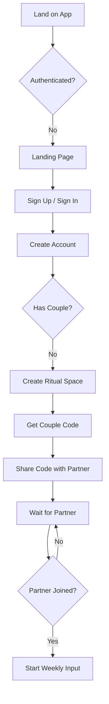
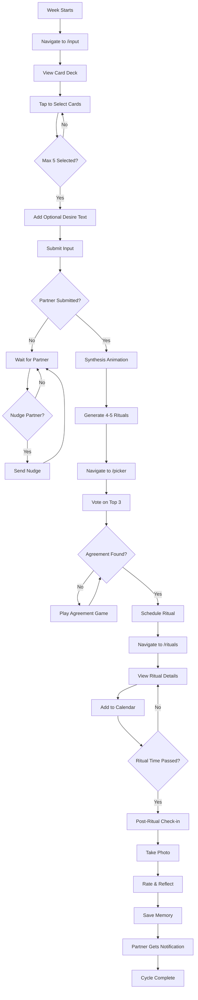
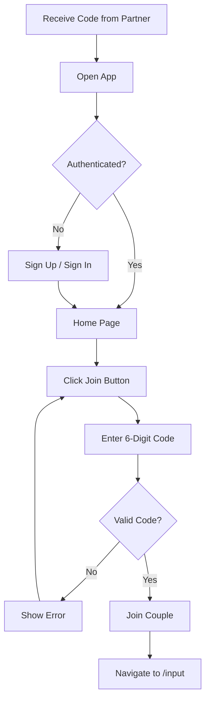
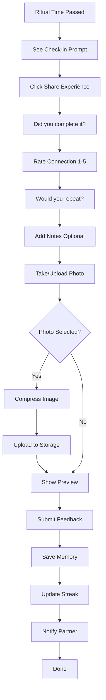
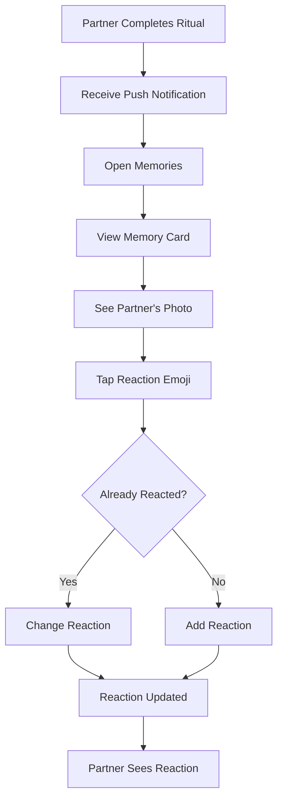

# User Flows Documentation

## Core User Journey

### Flow 1: New User Onboarding



### Flow 2: Weekly Ritual Cycle (Card Draw Input - v1.6+)



### Flow 3: Partner Joining with Code



### Flow 4: Post-Ritual Check-in with Photo



### Flow 5: Partner Reactions



## Detailed State Machine

### Application State Model

```
USER_STATE:
  - unauthenticated
  - authenticated_no_couple
  - authenticated_solo_couple (waiting for partner)
  - authenticated_active_couple

CYCLE_STATE:
  - no_cycle
  - awaiting_user_input
  - awaiting_partner_input
  - awaiting_synthesis
  - awaiting_agreement
  - ritual_scheduled
  - ritual_passed
  - feedback_complete

NAVIGATION_LOGIC:
  IF user = unauthenticated:
    → /auth or /landing
  
  IF user = authenticated_no_couple:
    → /home (show create/join options)
  
  IF user = authenticated_solo_couple:
    → /home (show couple code)
  
  IF couple_complete AND cycle = no_cycle:
    → /input
  
  IF cycle = awaiting_user_input:
    → /input
  
  IF cycle = awaiting_partner_input:
    → /home (waiting component)
  
  IF cycle = awaiting_synthesis:
    → /home (synthesis animation)
  
  IF cycle = awaiting_agreement:
    → /picker
  
  IF cycle = ritual_scheduled AND NOT ritual_passed:
    → /rituals
  
  IF cycle = ritual_passed AND NOT feedback_complete:
    → /home (post-checkin prompt)
```

## User Actions & System Responses

### 1. Card Draw Input (v1.6+)

**User Action:**
1. Navigate to /input
2. Tap mood cards to select (max 5)
3. Optionally add free-text desire
4. Click Submit

**System Response:**
1. Validate 1-5 cards selected
2. Save input to weekly_cycle with format: `{ selectedCards: [...], desire: "..." }`
3. Set submitted_at timestamp
4. Check if partner has submitted
5. If yes, trigger synthesis
6. If no, navigate to /home (waiting state)
7. Partner receives realtime update

**Mood Cards Available:**
- 🏔️ Adventure, 🛋️ Cozy, 💭 Deep Talk
- 🎮 Playful, 💕 Romantic, 😴 Tired
- ✨ Spontaneous, 🌳 Outdoors, 🎨 Creative
- 🍽️ Foodie, 💰 Budget, 💎 Splurge

### 2. Photo Upload

**User Action:**
1. In post-ritual check-in, tap camera icon
2. Select photo from gallery or take new
3. Preview image
4. Confirm upload

**System Response:**
1. Compress image client-side (target ~500KB)
2. Generate unique filename: `{couple_id}/{timestamp}.jpg`
3. Upload to `ritual-photos` bucket
4. Show progress indicator
5. On success, update `ritual_memories.photo_url`
6. Display photo preview in memory card

### 3. Partner Reactions

**User Action:**
1. Open memory card with partner's completion
2. Tap reaction emoji (❤️ 🔥 😍 🥹 👏)

**System Response:**
1. Check if user already reacted
2. If exists, update reaction
3. If new, insert reaction
4. Show reaction bubble on card
5. Partner sees reaction in realtime

### 4. Agreement Game

**User Action:**
1. Presented with partner's top 3 choices
2. Click "Pick One" on a card
3. Confirm selection

**System Response:**
1. Set agreed_ritual
2. Set agreement_reached = true
3. Navigate to /rituals
4. Partner receives realtime update

### 5. Complete Ritual

**User Action:**
1. Ritual time passes
2. Navigate to /home
3. See post-ritual check-in prompt
4. Fill out feedback form:
   - Did you complete it?
   - Connection rating (1-5)
   - Would repeat?
   - Notes
   - Photo (optional)
5. Submit

**System Response:**
1. Save to ritual_feedback table
2. If completed = yes, create completion record
3. Update ritual_streaks
4. Save to ritual_memories with photo_url
5. Call notify-partner-completion edge function
6. Partner receives push notification
7. Close post-checkin modal
8. Mark cycle as complete

## Accessibility Considerations

- **Keyboard Navigation:** All interactive elements keyboard accessible
- **Screen Readers:** Semantic HTML with ARIA labels
- **Focus Management:** Focus trapped in modals
- **Color Contrast:** WCAG AA compliant
- **Touch Targets:** Minimum 44x44px
- **Error Messages:** Clearly announced

## Mobile-Specific Flows

### iOS Safari Considerations
- **Install Prompt:** Add to Home Screen banner
- **Safe Areas:** pb-safe class for bottom nav
- **Push Notifications:** Require user interaction to enable

### Android Chrome Considerations
- **PWA Manifest:** Service worker registered
- **Push Notifications:** Full Web Push API support
